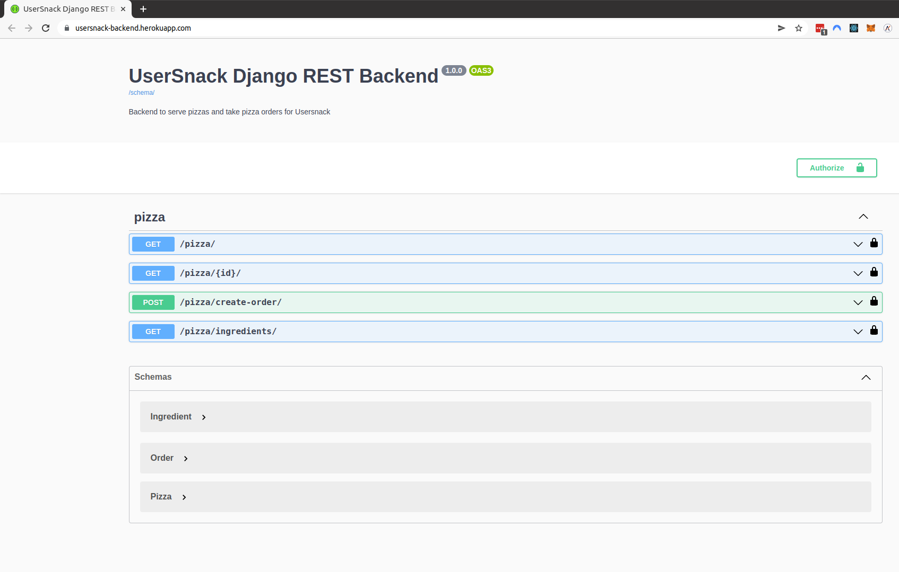

# Usersnack Django REST Backend

## Setup

Create and activate a virtual environment (python 3.8) using your preferred method.
From the command line, type:

```
pip install -r requirements.txt
python manage.py migrate
python manage.py runserver
```

Open your browser to http://localhost:8000 and you should see the browsable version of the API.

## Test

To run all tests

```
python manage.py test
```

## Commands

### Create sample seed data
```
python manage.py import_pizzas
```

### Delete all data

!!! Will delete ingredients, pizzas, and orders
```
python manage.py delete_data
```

### Base URL
```
https://usersnack-backend.herokuapp.com/
```

## Docs

### Swagger UI
Autogenereated API docs with drf-spectacular
```
https://usersnack-backend.herokuapp.com/
```


### Redoc
Autogenereated API docs with drf-spectacular
```
https://usersnack-backend.herokuapp.com/schema/redoc/
```
